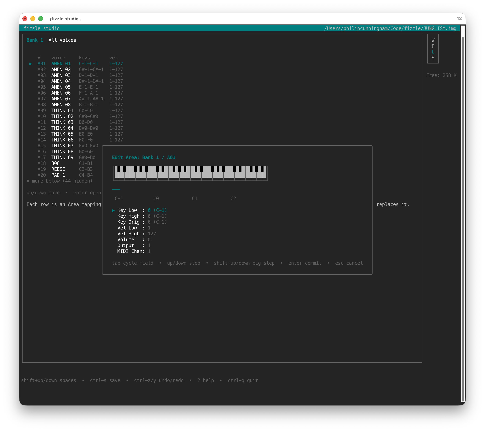

# fizzle

`fizzle` is a command-line tool for loading samples onto **Casio FZ series samplers** (FZ-1, FZ-10M, FZ-20M) via floppy disk images.

The FZ series are 16-bit samplers from the late 1980s, still used in jungle and experimental music for their distinctive sound. `fizzle` lets you convert modern sample libraries (WAV files, SFZ instruments) into the format the sampler reads from floppy disk, without needing a physical floppy drive.

The full reference, including the meaning of every flag and where each parameter lives on the sampler, is in [docs/fizzle-manual.md](docs/fizzle-manual.md). This README is the quickstart.

> [!IMPORTANT]
> **Status: alpha.** `fizzle` is young and under active development. So far it has been validated the hands-on way, through my own day-to-day workflow with a Casio FZ-10M, rather than across the full FZ series (FZ-1, FZ-10M, FZ-20M) or a wide spread of setups. Development and testing happen on macOS; the Linux and Windows builds are provided for convenience and have not yet been exercised on those platforms. Expect the occasional rough edge, and treat results on unfamiliar material with healthy curiosity.
>
> Because `fizzle` produces disk images your sampler loads, please **keep backups of your instruments, disks, and samples** before making destructive edits, and try a converted disk on non-essential data first. Real-world reports (what worked, what didn't, and on which hardware) are hugely welcome and are exactly what will help `fizzle` mature.

---

## What you need

- A **Casio FZ-1, FZ-10M, or FZ-20M** sampler
- A floppy emulator that accepts `.img` disk image files
- A way to copy the `.img` file to a USB stick (any file copy works)

---

## Install

**With Go installed** (requires Go 1.26+):

```sh
go install github.com/philipcunningham/fizzle/cmd/fizzle@latest
```

**Build from source:**

```sh
git clone https://github.com/philipcunningham/fizzle
cd fizzle
make build
make install                    # copies to /usr/local/bin
# make install PREFIX=~/.local  # or install to a custom location
fizzle --version                # verify the install
```

Or build for a specific platform:

```sh
make linux          # fizzle-linux-amd64
make darwin-arm64   # fizzle-darwin-arm64 (Apple Silicon)
make darwin-amd64   # fizzle-darwin-amd64 (Intel Mac)
make windows        # fizzle-windows-amd64.exe
```

**Shell completion** (bash, zsh, fish, pwsh):

```sh
source <(fizzle completion bash)   # bash: add to .bashrc
source <(fizzle completion zsh)    # zsh: add to .zshrc
fizzle completion fish > ~/.config/fish/completions/fizzle.fish  # fish
```

---

## 5-minute quickstart

Convert a folder of WAVs (or an SFZ instrument) into a disk image the sampler can load.

```sh
# 1. Convert an SFZ instrument to a full dump
#    --fit-to-disk automatically reduces sample rate if needed to fit on a floppy
fizzle sfz convert --fit-to-disk mydrums.sfz mydrums.fzf

# Export a full dump back to SFZ + WAVs
fizzle sfz export mydrums.fzf ./my-instrument/

# 2. Inspect the result (check key assignments and durations)
fizzle fzf info mydrums.fzf

# 3. Create a blank 1.25 MB disk image
fizzle disk new "My Drums" mydrums.img

# 4. Put the dump on the disk
fizzle disk add mydrums.img mydrums.fzf

# 5. Verify the disk
fizzle disk ls mydrums.img

# 6. Copy mydrums.img to your floppy emulator and load it on the sampler
```

You can pass a directory of WAVs instead of an SFZ file; each WAV gets assigned to a sequential key from C2 upward.

For other workflows (importing a single WAV, editing a voice in place, splitting a large instrument across two floppies, round-tripping a hardware FZF), see the [Quickstart walkthroughs](docs/fizzle-manual.md#quickstart-walkthroughs) chapter of the manual.

Long conversions respect Ctrl+C: cancel a running `sfz convert` and the command exits cleanly without leaving a half-written file.

---

## Studio: the interactive TUI



```sh
fizzle studio                    # use the current directory as workspace
fizzle studio ~/fz-library       # use a directory as workspace
```

`fizzle studio` is a workspace-oriented terminal editor for FZ-1 / FZ-10M / FZ-20M sound material. It takes a directory of `.img` / `.fzf` / `.fzv` / `.wav` files and opens them from the in-TUI Workspace browser. Omitting the argument uses the current working directory.

studio organises around four spaces: Workspace (file browser), Pool (a session-level basket of voices), Layout (the in-focus container's banks and Areas), and Sound (the currently selected voice, edited per-cell). `SHIFT+up` / `SHIFT+down` move between spaces. `Ctrl+S` saves, `Ctrl+Z` / `Ctrl+Y` undo and redo, `Ctrl+D` duplicates an Area for velocity multi-switching, `Ctrl+C` / `Ctrl+V` copy / paste between compatible cells, `Space` auditions, `?` opens contextual help, `Ctrl+Q` quits. studio includes autosave with crash recovery: dirty containers get a `.bak` snapshot next to the source file every 30 seconds, deleted on a successful save and offered for recovery if a crash occurs.

For the full feature set, key bindings, user workflows, and testing approach see [pkg/studio/README.md](pkg/studio/README.md).

---

## Logging

`fizzle` logs INFO-level progress to stderr by default. Add `--debug` to see per-file detail:

```sh
fizzle --debug sfz convert junglism.sfz junglism.fzf
```

---

## FAQ

**Why mono only?**
The FZ series records and plays back mono samples. Stereo is not supported by the hardware.

**Why only three sample rates?**
The FZ-1 supports 36 kHz, 18 kHz, and 9 kHz. Higher rates sound better but use more memory and disk space.

**What is the difference between .fzv and .fzf?**
A `.fzv` file holds one voice (one sample). A `.fzf` full dump holds up to 64 voices with a bank mapping that defines which keys play which samples. You usually want `.fzf` on the disk.

**Why does `sfz convert` warn about disk capacity?**
The FZ-1 uses 1.25 MB floppy disks. Large sample libraries at 36 kHz often exceed this. Use `--fit-to-disk` to downsample automatically, or use `--split-disks` to split across 2 disks.

**Can I use a real floppy drive instead of a USB emulator?**
Yes. Write the `.img` file to a 3.5" HD floppy using `dd` on macOS/Linux: `dd if=mydrums.img of=/dev/rdisk2 bs=512`. The FZ-1 uses a standard IBM-compatible format.

**Can I read .fzf files from original FZ disks?**
Yes. fizzle reads real hardware FZF files including multi-bank full dumps (up to 8 banks). Use `disk get` to extract from a disk image and `fzf unpack` to split into individual voice files.

---

## Acknowledgements

The [Casio FZ-1 Data Structures](docs/casio-fz1-data-structures.pdf) document (T. Sasaki, Casio R&D, 1987) is the primary reference for the disk and voice formats implemented here. A condensed technical summary of the format, including corrections and real-world findings, is in [docs/casio-fz1-format.md](docs/casio-fz1-format.md).

Rainer Buchty's [fztoolkit](http://www.buchty.net/casio/) (2000) is a set of C utilities for reading and writing FZ-1 disks directly from a Linux floppy drive. Its `voice_data` and `bank_data` struct layouts were a useful cross-check against the spec while implementing fizzle's voice and bank parsers; his firmware disassembly also informed the V50 ROM API notes in `testdata/assembly/DEMO.asm`.

[Jacob Vosmaer's fz1 project](https://github.com/jacobvosmaer/fz1) and his [write-up on FZ-1 disk images](https://blog.jacobvosmaer.nl/0057-fz-1-images/) (2025) were valuable references, particularly for the file head layout number correction and the heuristic for reconstructing layout numbers from FZF files found online.

The [Undecyclenate FZ Editor and Librarian](https://undecyclenate.neocities.org/manual) is prior art that scratched a similar itch on Windows XP. Its manual was a useful reference while structuring `docs/fizzle-manual.md`.

## License

[MIT](LICENSE)
