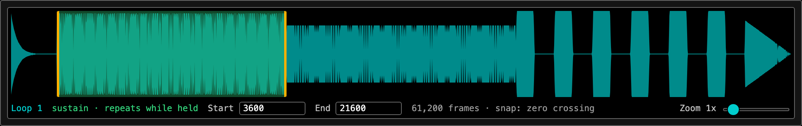
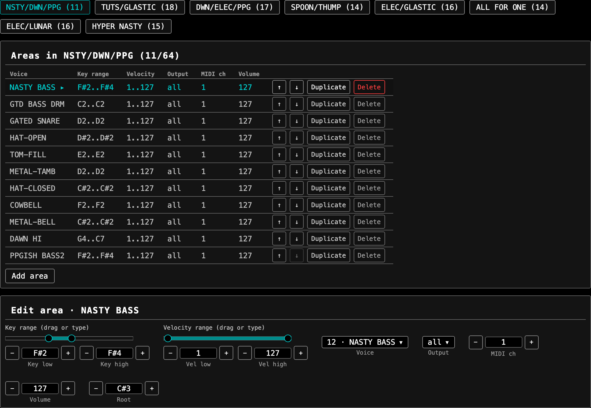

# fizzle manual

This manual explains FZ concepts and hardware behavior that command help can't express. See the generated [CLI reference](cli-reference.md) for commands, arguments, flags, and ranges.

Panel paths use `MENU/SUBMENU/PAGE`. Display values are numbers shown by the sampler; stored values are their encoded bytes.

## File types

### Voice

A voice combines one sample with its key range, root key, envelopes, filter, modulation, loops, tuning, and name. Standalone voice files use `.fzv`.

### Full dump

A full dump combines up to 64 voices with bank mappings. The mappings assign key and velocity ranges, MIDI channels, levels, and outputs. Full dump files use `.fzf` and appear on disk as `FULL-DATA-FZ`.

A standalone FZF doesn't store its voice count. fizzle infers it from bank data unless the enclosing disk supplies the count. A voice no bank plays can therefore be absent from a bare extraction. The browser editor stamps the disk's count into the file it exports, which keeps that voice.

### Bank dump

A bank dump contains bank mappings and voice headers without audio. The CLI inspects these uncommon `.fzb` files. The browser editor places one as a bank in the open instrument.

### Disk image

An `.img` file mirrors an FZ floppy: 1,280 sectors and 1,310,720 bytes. Copy it to a floppy emulator or write it to compatible media.

## Voice parameters

### Display values and stored bytes

CLI values follow the FZ panel. Envelope rates and levels use 0 through 99, tuning uses cents, and LFO delay uses 0 through 127.

fizzle preserves stored bytes for fields an edit doesn't target. This matters because converting a stored byte through a panel scale can be lossy.

The [display scale findings](../llm-wiki/topics/display-scales.md) record formulas and evidence.

### Keyboard range

`MODIFY/VOICE EDIT/KEYBOARD SET` defines low, root, and high notes for a voice. A full dump's bank mapping overrides the standalone voice range.

### DCA envelope

`MODIFY/VOICE EDIT/CREATE VOICE/DCA ENVELOPE` controls amplitude through eight rate and stop-level stages.

Stages through the sustain point run after note on. The sustain stage holds while the key remains down. Remaining stages run after release through the end point.

Edit flags use panel values from 0 through 99. The rate direction bit remains unchanged when a rate changes.

### DCF envelope and filter

`MODIFY/VOICE EDIT/CREATE VOICE/DCF ENVELOPE` controls an eight-stage filter envelope, cutoff, and resonance.

Cutoff 127 leaves the filter fully open. Resonance uses the complete stored byte despite older Casio documentation; see [dcq-full-byte](../llm-wiki/findings/dcq-full-byte.md).

### LFO

`MODIFY/VOICE EDIT/CREATE VOICE/LFO SET` controls waveform, synchronization, delay, rate, and modulation depths.

The waveform and synchronization flag share one byte, so editing either must preserve the other. LFO delay also determines the panel's attack value.

No panel control reaches the stored resonance depth. fizzle preserves that byte and doesn't expose an edit flag for it.

### Modulation

`MODIFY/VOICE EDIT/CREATE VOICE/VELOCITY SENS` controls velocity routing. Envelope pages contain their key-follow controls.

Most velocity depths are signed. Velocity to resonance is unsigned from 0 through 127 because its panel row has no sign field.

### Loops and playback

`MODIFY/VOICE EDIT/CREATE VOICE/LOOP SET` contains eight loop stages. Each stage has start, end, crossfade, repeat count, and next-stage behavior.

| Mode | Behavior |
|---|---|
| Normal | Plays forward and uses configured loops |
| Reverse | Plays backward without looping |
| Cue | Uses loops for sustained playback |
| Synth | Uses synthesized playback without loops |

Synth mode displays pitch six semitones low. Correcting that display requires opposite tuning.

WAV SMPL loops import automatically. SFZ `loop_start` and `loop_end` override WAV loop points during conversion.

### Tuning and names

`MODIFY/VOICE EDIT/DEFINE VOICE/VOICE NAME` accepts a 12-character ASCII name.

`MODIFY/VOICE EDIT/CREATE VOICE/TUNE/MEM READ` displays tuning from minus 100 through plus 100 cents. fizzle stores it in 1/256-semitone units.

## Banks, outputs, and MIDI

### Banks

A full dump can contain up to eight banks. Bank mappings decide which voice an area plays and hold its range, level, channel, and output.

### Outputs and polyphony

The FZ has eight generators. Each contributes one note of polyphony and drives its numbered physical output.

`MODIFY/BANK EDIT/CREATE BANK` assigns each voice an eight-bit output mask. One assigned generator makes a voice monophonic; all eight allow eight notes.

Voices assigned to the same single generator mute one another. SFZ `mutegroup` values use this behavior for choke groups.

### MIDI and Area Mode

Each bank area has a MIDI receive channel. Set `MAIN MENU/EFFECT/MIDI/MIDI FUNCTION` to `RECEIVE = AREA` for per-area multitimbral routing.

In Basic mode, differing stored channels don't provide independent routing.

### Performance controllers

`MODIFY/EFFECT/MIDI/BEND RANGE`, `MOD WHEEL`, and `AFTER TOUCH` route performance controllers. These depths belong to a bank rather than an individual voice.

The keyboard FZ-1 accepts the Casio VP-2 foot controller. Rack models support sustain control but not the VP-2.

## Working with files

### Build a disk from an SFZ

```sh
fizzle sfz convert --fit-to-disk drums.sfz drums.fzf
fizzle fzf info drums.fzf
fizzle disk new DRUMS drums.img
fizzle disk add drums.img drums.fzf
fizzle disk ls drums.img
```

### Edit a hardware dump

```sh
fizzle disk get original.img FULL-DATA-FZ original.fzf
fizzle fzf edit original.fzf --voice REESE --cutoff 80
fizzle disk new EDITED edited.img
fizzle disk add edited.img original.fzf
```

Editing changes only named fields. Keep the original image as a backup.

### Extract and rebuild voices

```sh
fizzle fzf unpack original.fzf voices
fizzle fzf build rebuilt.fzf voices/*.fzv
```

Voice order follows the arguments passed to `fzf build`.

## Browser editor

The [browser editor](https://philipcunningham.github.io/fizzle/) runs fizzle's Go core compiled to WebAssembly. It expects a desktop Chromium browser and warns when parts it relies on are missing.


Disk files sit on the left, and the open instrument fills the centre. Voices holds the voice table, the sample, the loop strip, and both envelope graphs. Banks and Areas holds the mapping. Effects holds the pitch bend range in eighths of a semitone, and the controller modulation matrix.

The keyboard along the bottom auditions the focused voice through its DCA envelope and loop chain.

Export writes the disk image. Export instrument writes the open dump as an `.fzf`, and each voice row writes a `.fzv` or a WAV.

### Reading the capacity meters


Two ceilings, measuring different things. Disk counts image bytes against the floppy, doubling once a document spans a two disk set. Memory counts the instrument's audio against the sampler you declare on the start screen.

Both meters count down, so a full one reads zero. fizzle remembers the declared sampler between sessions and starts at 1 MB. An import over that memory ceiling gets refused before it converts, so declaring the wrong machine changes what fizzle accepts.

### Reading the loop strip



The strip draws the selected voice and shades the selected loop. Its caption places that loop in the chain. A sustain loop repeats while a key stays down. A release loop takes over once the key comes up. A loop in neither position keeps the plain fill.

Drag a handle, or type frames into Start and End. Handles snap to the nearest zero crossing. Holding a key runs a cursor through the span the FZ repeats, drawing the chain as it plays.

### Reading the bank mapping



Each chip is a bank, and its figure counts the areas the bank holds. Selecting an area opens the editor beneath the table, where the key and velocity ranges drag or type.

### Editor and CLI

Both surfaces read and write the same files, and each holds something the other doesn't.

Only the CLI exports an instrument back to SFZ, with `sfz export`, and only the CLI runs over many files unattended.

Only the editor stamps the disk's voice count into a standalone `.fzf`, so a voice no bank plays survives the export. `disk get` writes the same dump without that count, and a later reading loses the voice.

### Regenerating these images

```sh
make docshots
```

The script drives the built app over the real core and rewrites every PNG under `docs/images`. Rerun it when a surface above moves.

## SFZ conversion

fizzle implements these SFZ opcodes:

| Opcode | FZ destination |
|---|---|
| `sample` | Voice audio |
| `lokey`, `hikey` | Bank key range |
| `key` | Low, high, and root key |
| `pitch_keycenter` | Root key |
| `lovel`, `hivel` | Bank velocity range |
| `transpose` | Semitone pitch offset |
| `tune` | Cent tuning |
| `mutegroup` | Shared single-generator assignment |
| `loop_mode` | One-shot or looping behavior |
| `cutoff` | Filter cutoff |
| `resonance` | Filter resonance |
| `loop_start`, `loop_end` | Loop sample positions |

Unsupported opcodes produce warnings and don't affect output.

## Hardware locations

| Function | Panel path |
|---|---|
| Voice name | `MODIFY/VOICE EDIT/DEFINE VOICE/VOICE NAME` |
| Keyboard range | `MODIFY/VOICE EDIT/KEYBOARD SET` |
| DCA envelope | `MODIFY/VOICE EDIT/CREATE VOICE/DCA ENVELOPE` |
| DCF envelope | `MODIFY/VOICE EDIT/CREATE VOICE/DCF ENVELOPE` |
| LFO | `MODIFY/VOICE EDIT/CREATE VOICE/LFO SET` |
| Velocity routing | `MODIFY/VOICE EDIT/CREATE VOICE/VELOCITY SENS` |
| Loops | `MODIFY/VOICE EDIT/CREATE VOICE/LOOP SET` |
| Tuning and mode | `MODIFY/VOICE EDIT/CREATE VOICE/TUNE/MEM READ` |
| Bank ranges, MIDI, and output | `MODIFY/BANK EDIT/CREATE BANK` |
| Controller routing | `MODIFY/EFFECT/MIDI/BEND RANGE`, `MOD WHEEL`, or `AFTER TOUCH` |
| Area Mode | `MAIN MENU/EFFECT/MIDI/MIDI FUNCTION` |

## Format evidence

The [knowledge wiki](../llm-wiki/index.md) records verified corrections to the Casio specification. The original specification remains available as [Markdown](../llm-wiki/sources/casio-fz1-data-structures.md) and [PDF](../llm-wiki/sources/casio-fz1-data-structures.pdf).
